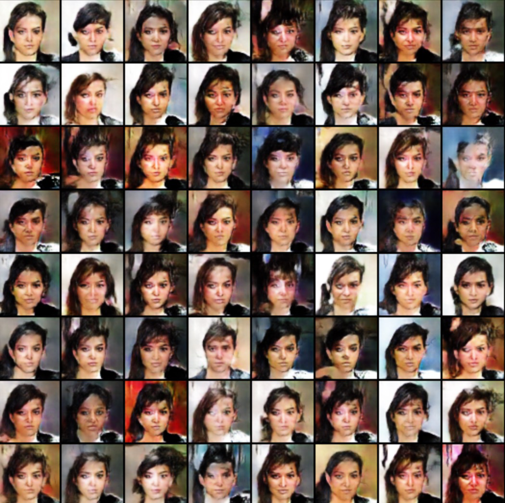

# DCGAN-WGAN
使用DCGAN结构结合WGAN损失函数在CelebA数据集上训练生成人脸

- 训练数据 CelebA数据集 http://mmlab.ie.cuhk.edu.hk/projects/CelebA.html
  - 解压到./img_align_celeba文件夹下
  - ./m_img: 存放中间图片
  - ./ckpt: 存放中间权重

- 原始GAN训练

  

- WGAN训练

  

- 原始GAN训练100个epoch

  

​	

- WGAN训练300个epoch

  

> 分别是第0，100，200，299个epoch时生成器G输出的结果

 

>参考资料
>
>[1] https://github.com/pytorch/examples/blob/main/dcgan/main.py
>
>[2] https://pytorch.org/tutorials/beginner/dcgan_faces_tutorial.html
>
>[3] https://blog.csdn.net/qq_37395293/article/details/103112721
>
>[4] Goodfellow I, Pouget-Abadie J, Mirza M, et al. Generative adversarial nets[J]. Advances in neural information processing systems, 2014, 27.
>
>[5] Radford A, Metz L, Chintala S. Unsupervised representation learning with deep convolutional generative adversarial networks[J]. arXiv preprint arXiv:1511.06434, 2015.
>
>[6] Arjovsky M, Chintala S, Bottou L. Wasserstein generative adversarial networks[C]//International conference on machine learning. PMLR, 2017: 214-223.
